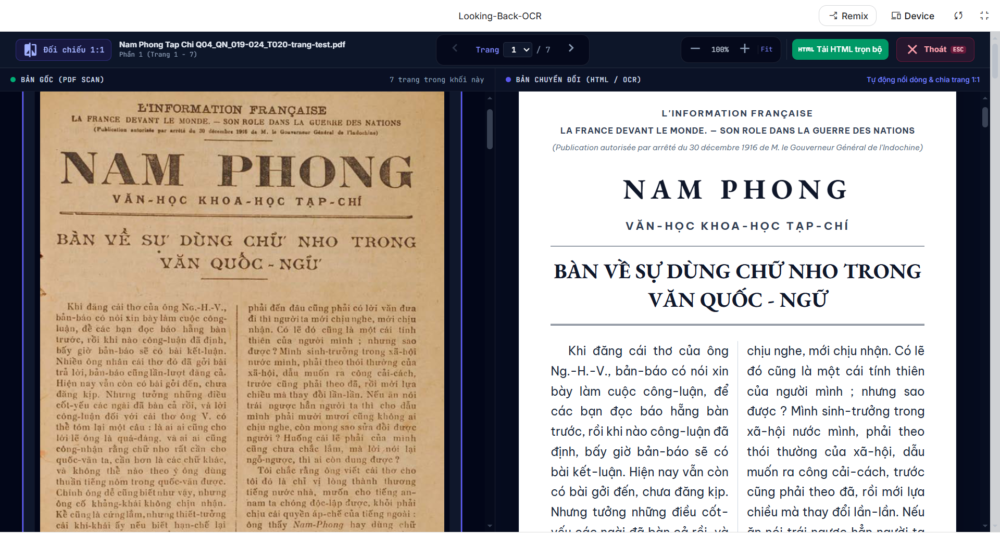
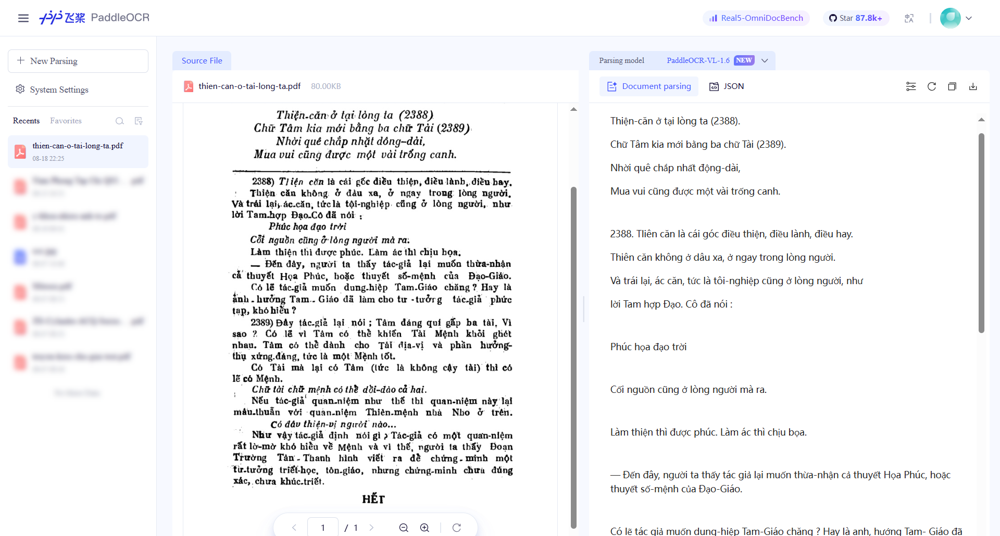
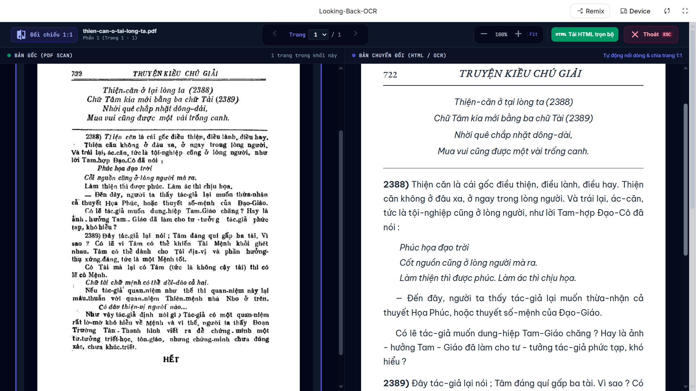
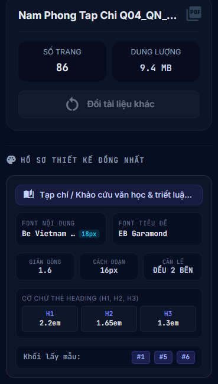
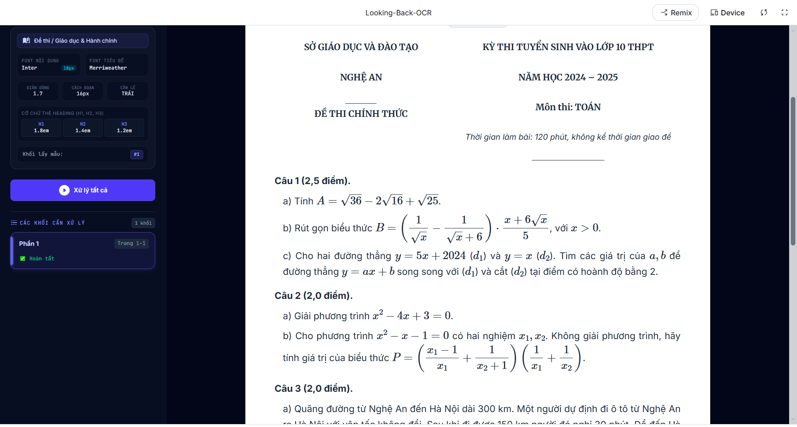
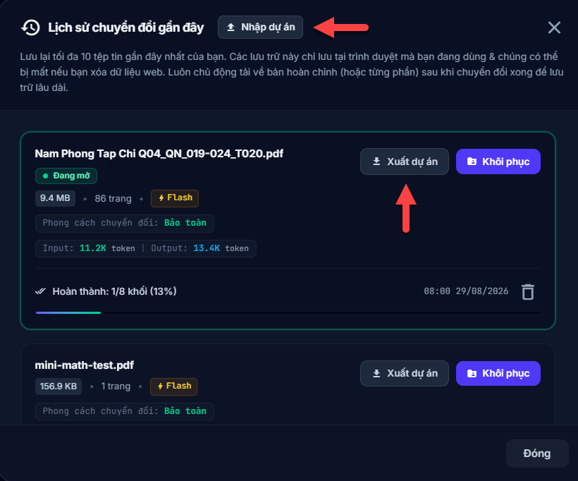

  
    <em>Một file PDF được OCR bởi Looking-Back-OCR</em>

Công cụ OCR tài liệu, sách xưa, sách scan bị mờ chữ tiếng Việt (ví dụ: `Nam Phong Tạp Chí`) bằng Gemini hoặc Meta AI. File đầu vào có thể là định dạng **PDF** hoặc **ảnh (JPG, PNG)**. Looking-Back-OCR cũng có khả năng bảo toàn công thức toán rất tốt, vì thế sách toán cũ nói riêng & sách khoa học nói chung cũng được xử lý ổn thỏa.

## Demo
- Bản PDF scan tải lên: [Nam_Phong_Tap_Chi_Q04_QN_019-024_T020.pdf](https://github.com/kiencang/Looking-Back-OCR/blob/main/demo/Nam_Phong_Tap_Chi_Q04_QN_019-024_T020.pdf) (Kho sách xưa - Huỳnh Chiếu Đẳng) 
- Bản web `.html` được OCR bởi `Looking-Back-OCR`: [Nam_Phong_Tap_Chi_Q04_QN_019-024_T020.html](https://github.com/kiencang/Looking-Back-OCR/blob/main/demo/Nam_Phong_Tap_Chi_Q04_QN_019-024_T020.html) (Tải về và mở bằng trình duyệt để xem).
- Bản `.docx`: [Nam_Phong_Tap_Chi_Q04_QN_019-024_T020.docx](https://github.com/kiencang/Looking-Back-OCR/blob/main/demo/Nam_Phong_Tap_Chi_Q04_QN_019-024_T020.docx) (Trước khi chuyển, bạn nhìn xuống footer, chọn kiểu chuyển "Đơn giản" là được, còn mặc định khi không chọn sẽ là kiểu "Bảo toàn" của định dạng web).

## Sử dụng
- **Mọi người có thể dùng phiên bản trên AI Studio thông qua link này**: https://aistudio.google.com/apps/513da822-939a-4929-ac44-2e0e86309b06?showPreview=true&showAssistant=true&fullscreenApplet=true (để tận dụng **ngưỡng miễn phí hàng ngày** tương đổi rộng rãi của Gemini).
- Bản web: https://looking-back-ocr.wpsila.com/ (chỉ key trả phí mới dùng được).

2 bản trên là một, và có chất lượng như nhau.

**Lưu ý**: Với trường hợp sử dụng KEY miễn phí trên AI Studio hoặc sử dụng model trợ giá của Muse (`muse-spark-1.2-contributor`), người dùng chỉ nên up lên tài liệu đã hết hạn bản quyền, vì các model trên có thể sẽ sử dụng dữ liệu người dùng up lên để đào tạo model AI của họ.

### Một số giới hạn tải lên
- Nếu bạn tải lên một file PDF, giới hạn là từ 100MB đổ xuống & không quá 500 trang;
- Nếu bạn tải lên nhiều file PDF cùng lúc, số lượng tối đa không quá 20 file, mỗi file không quá 12 trang & không lớn hơn 10MB mỗi file;
- Nếu bạn tải lên nhiều ảnh, số lượng không quá 100 ảnh, mỗi ảnh không quá 5MB;
- Lưu ý, công cụ sẽ không nhận file tải lên lẫn lộn định dạng, tức là vừa PDF vừa ảnh.
- Bạn chỉ nên tải lên hoặc là file PDF hoặc là file ảnh (có thể vừa JPG vừa PNG, cái này thì không vấn đề gì).

Phần `Lịch sử` (nằm bên phải trên header) chứa danh sách 10 dự án chuyển đổi gần đây nhất, để bạn có thể tiện xem lại khi cần.

## Tại sao tồn tại?
Sách xưa có khá nhiều cuốn thú vị, tuy nhiên định dạng PDF scan có thể không dễ đọc do **bản chất sách gốc đã bị ố mờ** hoặc do **phương pháp scan không đủ tốt** để tạo ra phiên bản nét đọc được ngay.

**Looking-Back-OCR** ra đời nhằm khắc phục phần nào tình trạng đó. Nó giúp tái tạo lại sách xưa, sách cũ với chữ rõ ràng & dễ đọc hơn. Ngoài ra là hiệu ứng phụ tích cực (dù có thể không quan trọng lắm), đấy là bản OCR thường có dung lượng nhẹ hơn đáng kể so với bản gốc, việc truyền tải, chia sẻ do vậy sẽ dễ dàng hơn.

## So sánh với đối thủ
OCR giờ nở rộ (một phần vì các AI cần phải nạp thông tin có rất nhiều từ các file PDF), hiện có nhiều công cụ chất lượng có khả năng OCR file PDF scan tiếng Việt.

Đặt lên bàn cân giữa Looking-Back-OCR và một công nghệ OCR hàng đầu hiện nay như [PaddleOCR](https://aistudio.baidu.com/paddleocr) có thể thấy rõ ưu và nhược của từng cái.

PaddleOCR vẫn tách được ảnh kể cả trong các file PDF scan. Tuy nhiên về độ chính xác, đặc biệt là chính tả, Looking-Back-OCR lại tỏ ra vượt trội (không phải do tôi thông minh hơn, mà vì Gemini thông minh hơn!).

Một đối thủ mạnh khác là [MinerU](https://mineru.net/), so với nó, Looking-Back-OCR cũng có chất lượng chính tả tốt hơn nhiều.

---

Để tiện thể nhìn thấy so sánh, tôi chụp màn hình kết quả OCR của một trang trong cuốn sách xưa `Truyện-Kiều Chú-Giải` của tác giả `Văn-Hòe`.

  
    <em>Kết quả của PaddleOCR, vẫn còn khá nhiều lỗi chính tả.</em>

  
    <em>Kết quả của Looking-Back-OCR, mức độ chính xác chính tả rất cao.</em>

Một sản phẩm của chính Google là Google Docs cũng có khả năng OCR chữ mờ rất tốt, tuy nhiên nó lại giữ định dạng kém, hầu hết các file PDF scan được bật qua Google Docs đều sẽ rất khó đọc do bố cục bị rối loạn.

[Thời điểm các so sánh trên được thực hiện: 18/08/2026], các công cụ có thể có cải tiến sau thời điểm này.

## Công nghệ
Mặc định công cụ này sử dụng Gemini AI, và bạn nên dùng bản trên AI Studio để tiết kiệm chi phí tối đa.

Gemini AI có khả năng OCR tài liệu rất tốt, chi phí bằng 0 nếu nhu cầu hàng ngày không quá lớn (tầm khoảng 150 - 200 trang / ngày / tài khoản với model Flash).

Looking-Back-OCR kế thừa và phát triển từ công cụ trước đó (cùng tác giả): https://github.com/kiencang/pdf-2-epub-docx

Điểm khác biệt cơ bản là Looking-Back-OCR tập trung vào sách cũ, tối ưu tái tạo định dạng, và mục đích là để con người đọc trực tiếp.

Ngoài Gemini, công cụ này còn tích hợp thêm Meta AI. Meta có khả năng OCR không tốt bằng Gemini, nhưng nó đỡ khó tính hơn Gemini trong vấn đề chặn chuyển đổi. Gemini đôi khi nhận nhầm một sách đã hết hạn bảo hộ là vẫn còn bản quyền và không cho phép chuyển.

### Các model
Có 4 model có thể chọn lựa qua giao diện của ứng dụng:
- 3 model mới nhất của Gemini là Flash, Lite, Pro;
- 1 model mới nhất của Meta AI;

Trong đó mặc định ứng dụng sẽ sử dụng model Flash, nó có chất lượng tốt và ngưỡng miễn phí đủ rộng. Nó có khả năng xử lý các tài liệu có cấu trúc phức tạp, chữ mờ khó nhìn.

Model Lite ở thời điểm hiện tại chỉ nên dùng như một dạng kiểm tra, test thử, hoặc nếu muốn dùng chính thức thì chỉ cho các tài liệu có cấu trúc đơn giản và chữ vẫn còn nhìn khá rõ.

Model Pro là model mạnh nhất trong dòng Gemini, tốc độ chậm hơn, có thể phù hợp cho tài liệu có cấu trúc rất phức tạp. Trên tài khoản miễn phí, model Pro bị giới hạn lượt request sớm hơn khá nhiều so với model Flash.

## Hai kiểu tái tạo
Trước khi OCR, người dùng có quyền chọn một trong hai định dạng dưới đây:
- **HTML/CSS**: Định dạng web, giúp bảo toàn tối đa định dạng gốc, ví dụ bản gốc chia 2 cột thì bản HTML/CSS cũng chia 2 cột. Tuy nhiên điều này không có nghĩa là sao chép định dạng gốc 100%, nó thiên về tái tạo hơn, và có thể có những điểm không giống, ví dụ như loại font chữ hoặc cỡ font;
- **Markdown**: Định dạng tối giản, nhưng lại có khả năng xuất ra Docx, giúp người dùng có thể biên tập thêm khi cần;

Tóm lại: Nếu bạn muốn đọc bản OCR có mức độ giống cao nhất với bản gốc, không chỉ nội dung mà còn là cả hình thức, hãy dùng cách chuyển đổi HTML/CSS (còn gọi là "Bảo toàn"). Còn nếu bạn quan tâm đơn thuần đến việc đọc, muốn tiết kiệm token đầu ra (ví dụ khi bạn dùng API Key trả phí) hãy dùng kiểu chuyển sang Markdown (còn gọi là "Đơn giản"). Ngoài ra nếu có nhu cầu biên tập lại thì chỉ có kiểu Markdown mới giúp bạn có được định dạng Docx.

Hai tùy chọn "Đơn giản" và "Bảo toàn" nằm ở góc ngoài cùng bên trái thuộc footer/chân trang. Mặc định Looking-Back-OCR thiết lập cài đặt là "Bảo toàn", tức là bản OCR sẽ có định dạng tương đồng với bản gốc. 

Sau khi đã thực hiện OCR rồi, nếu muốn thay đổi kiểu chuyển đổi (ví dụ từ "Bảo toàn" sang "Đơn giản"), bạn bắt buộc phải tải lại file lên, chọn kiểu bạn muốn, rồi thực hiện chuyển đổi lại.

### Hồ sơ thiết kế đồng nhất
Một cuốn sách sẽ được Looking-Back-OCR chủ động chia thành nhiều chunk (phần), ở kiểu chuyển đổi sang HTML/CSS, trước khi chuyển đổi chính thức được thực hiện, 3 chunk mẫu (mặc định mỗi chunk có tối đa 12 trang) sẽ được công cụ tự động đưa vào bước phân tích thiết kế. Mục đích là để tạo ra thiết kế thống nhất cho toàn bộ kết quả của từng chunk.

  
    <em>Thiết kế chung được áp dụng cho file kết quả</em>

3 chunk mẫu này sẽ gồm một chunk ở đầu cuốn và 2 chunk ở giữa cuốn. Ở những phiên bản cũ hơn, ứng dụng lấy 3 chunk là đầu, giữa và cuối, tuy nhiên tôi nhận thấy phần cuối thường ít phản ánh thiết kế đặc trưng của sách, do vậy tôi chuyển thành như hiện tại, thay thế chunk cuối bằng một chunk nữa ở giữa sách.

Các thông tin thiết kế thống nhất bao gồm:
- Kiểu font cho nội dung chính và kích cỡ của nó, và ở đây chỉ chọn font không chân cho dễ đọc trên màn hình;
- Kiểu font cho tiêu đề (cho phép chọn font không chân hoặc có chân trong bộ 10 font được phép dùng);
- Các thông tin giãn dòng, cách đoạn, căn lề;
- Cỡ font cho `h1`, `h2` `h3`;

Đối với kiểu chuyển PDF -> Markdown thì không cần hồ sơ thiết kế thống nhất.

### Có khả năng xử lý công thức toán
Công cụ tích hợp sẵn khả năng xử lý và biểu diễn công thức toán học. Nếu có các file scan như đề thi, sách toán cũ, Looking-Back-OCR sẽ tái tạo rất tốt:

  
    <em>Một đề thi toán được tái tạo lại từ file PDF scan.</em>

## Xuất/Nhập dự án
Với kiểu chuyển đổi dựa trên Gemini, ngưỡng miễn phí có thể hết giữa chừng khi bạn đang chuyển đổi một cuốn sách lớn (ví dụ 400 trang, và mới chuyển được khoảng 200 trang thì hết ngưỡng miễn phí hàng ngày). Lúc này bạn có hai lựa chọn:
- Đợi đến ngày hôm sau, khi ngưỡng miễn phí được cấp lại rồi tiến hành chuyển đổi tiếp;
- hoặc Xuất dự án, rồi Nhập lại dự án trên tài khoản khác (còn ngưỡng miễn phí) để chuyển đổi tiếp ngay lập tức;

  
    <em>Xuất nhập dự án để chuyển sang tài khoản khác chuyển đổi tiếp</em>

Button "Xuất dự án" và "Nhập dự án" nằm ở khu vực "Lịch sử".

## Tuyên bố từ chối trách nhiệm
Công cụ này có thể được sử dụng cho mục đích nghiên cứu và học tập cá nhân.

Looking-Back-OCR cũng như người phát triển nó không đưa ra bất kỳ bảo đảm rõ ràng hay ngụ ý nào, cũng như không tuyên bố rằng công cụ sẽ vận hành hoàn hảo, chính xác hoặc cập nhật. Người phát triển sẽ không chịu trách nhiệm cho bất kỳ tổn thất hay thiệt hại nào phát sinh trực tiếp hoặc gián tiếp liên quan đến hoặc phát sinh từ việc sử dụng công cụ này.

## Ghi công
Dưới đây là danh sách các thư viện quan trọng được Looking-Back-OCR sử dụng:

### 1. Nền tảng Ứng dụng & Giao diện (Framework & UI)
*   **[Angular (v21)](https://angular.dev/)** – Phát triển bởi **Google**. Lõi chính của ứng dụng.
*   **[Tailwind CSS (v4)](https://tailwindcss.com/)** – Cung cấp giao diện cho ứng dụng & bản HTML chuyển đổi.

### 2. Xử lý và Phân tích tài liệu PDF
*   **[PDF-Lib](https://pdf-lib.js.org/)** – Xử lý tách trang, chia chunk.
*   **[KaTeX](https://katex.org/)**: Thư viện xử lý và hiển thị công thức toán học do Khan Academy phát triển. Đóng vai trò là engine chuyển đổi các công thức toán học LaTeX (được AI bóc tách từ tài liệu) sang định dạng XML chuẩn `MathML`. Nhờ cấu trúc MathML nguyên bản này, các công thức phức tạp được giữ nguyên định dạng khi xuất sang dạng tài liệu **Microsoft Word (.docx)**.

### 3. Đọc/Ghi & Tạo định dạng đầu ra
*   **[Docx.js](https://docx.js.org/)** – Phát triển bởi **Dolan Miu**. Thư viện tạo tệp tin Microsoft Word (.docx) chạy trực tiếp trên trình duyệt (Client-side).
*   **[Marked.js](https://marked.js.org/)** – Trình biên dịch Markdown, giúp biên dịch dữ liệu văn bản từ AI phản hồi thành mã HTML sạch, để hiển thị xem trước.
*   **[JSZip](https://stuk.github.io/jszip/)** – Phát triển bởi **Stuart Knightley**. Thư viện giúp đóng gói dữ liệu nén định dạng ZIP để tải về.
