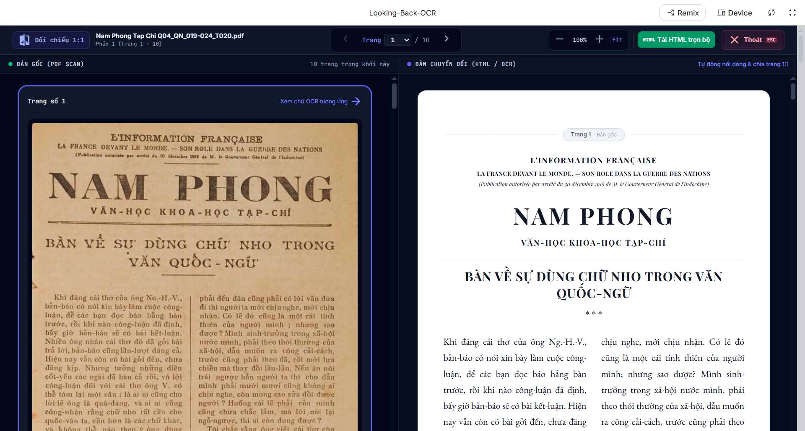

  
    <em>Một file PDF được OCR bởi Looking-Back-OCR</em>

Công cụ OCR tài liệu, sách xưa tiếng Việt (ví dụ: Nam Phong Tạp Chí) bằng Gemini hoặc Meta AI.

Mọi người có thể dùng phiên bản trên AI Studio thông qua link này: https://aistudio.google.com/apps/513da822-939a-4929-ac44-2e0e86309b06?showPreview=true&showAssistant=true&fullscreenApplet=true (để tận dụng ngưỡng miễn phí hàng ngày tương đổi rộng rãi của họ).

## Tại sao tồn tại
Sách xưa có khá nhiều cuốn thú vị, tuy nhiên định dạng scan có thể không dễ đọc do **bản chất sách gốc bị mờ** hoặc do **phương pháp scan không đủ tốt** để tạo ra phiên bản nét đọc được ngay.

**Looking-Back-OCR** ra đời nhằm khắc phục phần nào tình trạng đó. Nó giúp tái tạo lại sách xưa với chữ rõ ràng & dễ đọc hơn. Ngoài ra là hiệu ứng phụ tích cực (dù có thể không quan trọng) là bản OCR thường có dung lượng nhẹ hơn đáng kể so với bản gốc, việc truyền tải, chia sẻ do vậy sẽ dễ dàng hơn.

## Công nghệ
Mặc định công cụ này sử dụng Gemini AI, và bạn nên dùng bản trên AI Studio để tiết kiệm chi phí tối đa.

Gemini AI có khả năng OCR tài liệu rất tốt, chi phí bằng 0 nếu nhu cầu hàng ngày không quá lớn.

Looking-Back-OCR kế thừa và phát triển từ công cụ trước đó (cùng tác giả): https://github.com/kiencang/pdf-2-epub-docx

Điểm khác biệt cơ bản là Looking-Back-OCR tập trung vào sách xưa, và nó xuất ra nhiều định dạng hơn, cũng như mục đích là để con người đọc trực tiếp.

## Hai kiểu tái tạo
Ứng dụng này sau khi OCR nội dung gốc sẽ xuất ra một trong hai định dạng mà người dùng chọn:
- **HTML/CSS**: định dạng web, giúp bảo toàn tối đa định dạng gốc, ví dụ bản gốc chia 2 cột thì bản HTML/CSS cũng chia 2 cột. Tuy nhiên điều này không có nghĩa là sao chép định dạng gốc 100%, nó thiên về tái tạo hơn, và có thể có những điểm không giống, ví dụ như loại font chữ hoặc cỡ font;
- **Markdown**: định dạng đơn giản hơn, nhưng lại có khả năng xuất ra Docx, giúp người dùng có thể biên tập thêm khi cần;

Tóm lại: Nếu bạn muốn đọc bản OCR có mức độ giống cao nhất với bản gốc, không chỉ nội dung mà còn là cả định dạng, hãy dùng cách chuyển đổi HTML/CSS (còn gọi là "Bảo toàn"). Còn nếu bạn quan tâm đơn thuần đến việc đọc, muốn tiết kiệm token đầu ra (ví dụ khi bạn dùng API Key trả phí) hãy dùng kiểu chuyển sang Markdown (còn gọi là "Đơn giản"). Ngoài ra nếu có nhu cầu biên tập lại thì chỉ có kiểu Markdown mới giúp bạn có được định dạng Docx.

## So sánh với đối thủ
OCR giờ nở rộ, hiện có rất nhiều công cụ chất lượng cao làm được điều này.

Đặt lên bàn cân giữa Looking-Back-OCR và một công nghệ OCR hàng đầu hiện nay là [PaddleOCR](https://aistudio.baidu.com/paddleocr) có thể thấy rõ ưu và nhược của từng cái.

PaddleOCR vẫn tách được ảnh kể cả trong các file PDF scan. Tuy nhiên về độ chính xác, đặc biệt là chính tả, Looking-Back-OCR lại tỏ ra vượt trội.

Một đối thủ mạnh khác là [MinerU](https://mineru.net/), so với nó, Looking-Back-OCR cũng có chất lượng chính tả tốt hơn nhiều.

[Thời điểm các so sánh trên được thực hiện: 15/08/2026], các công cụ có thể có cải tiến sau thời điểm này.

## Tuyên bố từ chối trách nhiệm
Công cụ này có thể được sử dụng cho mục đích nghiên cứu và học tập cá nhân.

Looking-Back-OCR cũng như người phát triển nó không đưa ra bất kỳ bảo đảm rõ ràng hay ngụ ý nào, cũng như không tuyên bố rằng công cụ sẽ vận hành hoàn hảo, chính xác hoặc cập nhật. Người phát triển sẽ không chịu trách nhiệm cho bất kỳ tổn thất hay thiệt hại nào phát sinh trực tiếp hoặc gián tiếp liên quan đến hoặc phát sinh từ việc sử dụng công cụ này.

## Ghi công
Dưới đây là danh sách các thư viện quan trọng mà ứng dụng này sử dụng:

### 1. Nền tảng Ứng dụng & Giao diện (Framework & UI)
*   **[Angular (v21)](https://angular.dev/)** – Phát triển bởi **Google**. Lõi chính của ứng dụng.
*   **[Tailwind CSS (v4)](https://tailwindcss.com/)** – Cung cấp giao diện cho ứng dụng.

### 2. Xử lý và Phân tích tài liệu PDF
*   **[PDF-Lib](https://pdf-lib.js.org/)** – Xử lý tách trang, chia chunk.
*   **[KaTeX](https://katex.org/)**: Thư viện xử lý và hiển thị công thức toán học do Khan Academy phát triển. Đóng vai trò là engine chuyển đổi các công thức toán học LaTeX (được AI bóc tách từ tài liệu) sang định dạng XML chuẩn `MathML`. Nhờ cấu trúc MathML nguyên bản này, các công thức phức tạp được giữ nguyên định dạng khi xuất sang dạng tài liệu **Microsoft Word (.docx)**.

### 3. Đọc/Ghi & Tạo định dạng đầu ra (EPUB, DOCX, ZIP)
*   **[Docx.js](https://docx.js.org/)** – Phát triển bởi **Dolan Miu**. Thư viện tạo tệp tin Microsoft Word (.docx) chạy trực tiếp trên trình duyệt (Client-side).
*   **[Marked.js](https://marked.js.org/)** – Trình biên dịch Markdown, giúp biên dịch dữ liệu văn bản từ AI phản hồi thành mã HTML sạch, để hiển thị xem trước.
